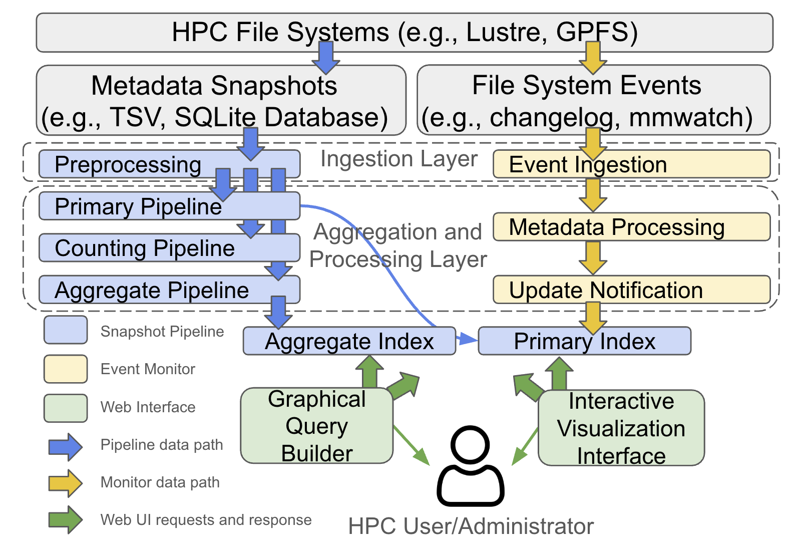

# Icicle

Scalable metadata indexing and monitoring for HPC file systems.

[Paper (coming soon)]() | [Documentation](https://globus-labs.github.io/icicle/) | [ISC High Performance 2026](https://isc-hpc.com/)

## Overview

HPC file systems store billions of files across thousands of storage targets, yet administrators lack unified metadata visibility for storage accounting, quota enforcement, compliance auditing, and data lifecycle management. Snapshot-only tools miss changes between scans; event-only tools lack historical baselines.

Icicle addresses these limitations with a unified framework that combines bulk snapshot ingestion and real-time event monitoring, populating a **dual-index architecture**: a **primary index** with per-file POSIX metadata and an **aggregate index** with pre-computed statistical summaries (quantile sketches for size and timestamps, grouped by user, group, or directory).

<p align="center">
  
</p>

> **Branch guide:** Active development happens on [`v4-dev`](https://github.com/globus-labs/icicle/tree/v4-dev), which includes deployment scripts, documentation, and refactored code. The [`main`](https://github.com/globus-labs/icicle/tree/main) branch is the camera-ready version accompanying the paper.

### Installation

Requires Python >= 3.11. PyFlink's transitive dependency on `apache-beam` breaks on macOS (`pkg_resources`), so we separate the install targets:

- **`dev-core`**: Event monitor + all test/lint deps. Works on macOS and Linux.
- **`dev`**: Everything in `dev-core` plus PyFlink (`apache-flink==1.20`). Use on the remote Ubuntu dev machine for ingest pipelines.

```bash
python3 -m venv .venv
source .venv/bin/activate

# macOS or Linux — event monitor development
pip install -e '.[dev-core]'

# Linux — includes PyFlink for ingest pipelines
pip install -e '.[dev]'
```

## Citation

<!-- TODO: add bibtex entry after camera-ready -->
Coming soon.

## Acknowledgements

We thank the teams of the [Diaspora Project](https://diaspora-project.github.io/) and [Globus](https://www.globus.org/) for their valuable comments and feedback. This work was supported in part by the Diaspora Project, funded by the U.S. Department of Energy, Office of Science, Office of Advanced Scientific Computing Research, under Contract DE-AC02-06CH11357, and by the Globus Search Project, funded by the National Science Foundation under Award 2411188.

## License

Distributed under the MIT License. See [LICENSE](LICENSE).
